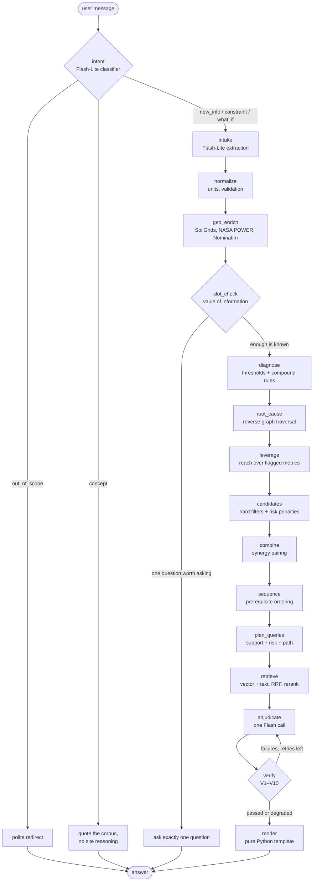

# Darukaa — AI Biodiversity Intelligence System

A land-management advisor that behaves like an environmental scientist rather than a chatbot.
The diagnosis, the causal simulation, the ranking and the confidence score are all computed in
Python. Gemini explains the result and challenges it. Nothing reaches the user until it has been
checked against a retrieved source.

The design rule this repository follows: **what the code decides is separate from what the
language model explains.**

---

## Architecture



Every box above is a LangGraph node. The conditional edges — not the model — decide whether the
system asks a question, runs the full pipeline, or answers from memory.

Intent is classified before anything is read into the profile, so a general question is
never mined for site values it does not contain. One route deliberately bypasses the reasoning
engine: `concept` answers a general question by
quoting the corpus with citations and no LLM in the loop at all, then says plainly that this is
general evidence rather than advice for the user's site.

### Division of responsibility

| Component | Responsible for | Never responsible for |
|---|---|---|
| LangGraph | control flow, state, retries, checkpoints | content decisions |
| Rule engine + causal graph | diagnosis, filtering, simulation, sequencing | natural language |
| Retrieval | finding evidence, scoring, labelling it | deciding what is true |
| Gemini | extraction, explanation, critique of the ranking | profile values, confidence, effect sizes |
| Verification | guaranteeing every claim is grounded | blocking the response entirely |

---

## Data model

MongoDB Atlas, database `darukaa`.

| Collection | Count | Contents |
|---|---|---|
| `chunks` | 1008 | passages, 768-dim embeddings, extracted claims |
| `variable_graph` | 505 | causal edges (342 traversable) |
| `practices_draft` | 16 | extracted practice profiles, source material for the cards |
| `sessions` | per user | site memory, constraints, per-turn traces |

Two Atlas indexes on `chunks`:

- `vector_index` — 768 dims, cosine, filters on `climate_zones`, `practices`, `metrics`,
  `evidence_level`, `content_role`, `context_only`, `doc_id`
- `text_index` — Atlas Search over `text`, `topic`, `doc_title`

A chunk carries its own provenance (`doc_id`, `page_start`, `evidence_level`) and a `claims`
array. **A claim is the only thing that licenses a number in the output.**

```json
{
  "metric": "SOC", "direction": "increase", "value": 7.3, "unit": "percent",
  "basis": "mean across 61 cover-crop studies",
  "evidence_span": "verbatim sentence containing the number"
}
```

### The knowledge layer

RAG answers *what does the literature say*. These files answer *what does this site need*:

| File | Holds |
|---|---|
| `knowledge/thresholds.json` | metric bands and categorical rules, each with its source |
| `knowledge/compound_rules.json` | interacting problem patterns such as the carbon–water trap |
| `knowledge/practices/*.json` | 19 practice cards: what each addresses, blocks on, risks |
| `knowledge/regional_defaults.json` | zone-level fallbacks, each with its source |

Practice cards carry **no effect sizes**. Numbers come only from retrieved claims, so every
figure shown to a user carries a citation.

---

## How the knowledge base was built

1. **Curated corpus, not bulk scraping.** 14 documents: IPCC SRCCL and IPBES assessments for
   authority, FAO *Recarbonizing Global Soils* vols. 3 and 4 for practice detail, Joshi et al.
   (2023) for quantified meta-analysis, and India-specific agroforestry sources.
2. **Structured extraction.** Each document was parsed into units, then Flash-Lite tagged every
   passage with practices, metrics, climate zones and an `evidence_span`-checked claims array.
3. **Causal edges.** Cause → effect links extracted per chunk were aggregated into
   `variable_graph`, keeping the conditions verbatim ("semiarid regions", "dryland areas").
4. **Embedding.** `gemini-embedding-001` at 768 dims, documents as `RETRIEVAL_DOCUMENT`,
   L2-normalised (truncated Matryoshka vectors are not normalised by the API).
5. **Practice cards by hand.** Drafts were generated from `practices_draft`, then hand-finished
   so each `soft_risk` traces to something a source actually states.

`db_ingestion/ingest.py` reproduces steps 2–4.

---

## The reasoning that makes this non-obvious

For the brief's own semi-arid, low-rainfall test case the system **downgrades cover crops on its
own**, even though cover cropping is the textbook answer to low soil carbon:

```
CANDIDATES (semi-arid, SOC 0.3%, 400 mm, wheat monoculture)
  0.769  intercropping             coverage 0.75  benefit +3.34
  0.732  mulching                  coverage 0.50  benefit +2.00
  ...
  0.562  cover_crops               coverage 0.75  benefit +0.97  penalty 0.25
         downgraded: cover crop water use competes with the cash crop in dry conditions
```

Three independent mechanisms produce that result:

- a condition-aware graph edge, `cover_crops → soil_moisture (decrease)` under `semiarid regions`
- a `soft_risk` on the practice card, firing on `climate_zone in [arid, semi-arid]`
- a **risk query** issued for every candidate, which retrieves FAO Vol. 4 p227: *"Competition for
  water with the main crop can be promoted, especially in dry years"*

The same practice scores differently on different land, because `condition_holds()` evaluates each
edge against the site rather than applying the evidence globally.

---

## Verification

| # | Check | On failure |
|---|---|---|
| V1 | structure valid, practice is a real candidate | retry |
| V2 | every `S#` exists in the evidence block | retry |
| V3 | every number matches a claim: same metric, same unit, value in range | retry, then strip the number |
| V4 | direction agrees with the claim or a graph edge | retry |
| V5 | cited chunk's climate fits the site | lower confidence |
| V6 | mechanism has a source and a risk query ran for that practice | retry |
| V7 | mechanism is supported by the cited text (Flash-Lite judge) | one retry, then soften |
| V8 | no generic filler | retry |
| V9 | every reasoning step anchors to a real path id or `S#` | strip the step |
| V10 | each recommendation connects ≥3 environmental variables | retry, drop if impossible |

Verification never blocks a response. When retries are spent the answer degrades: unverifiable
numbers are stripped, unanchored reasoning steps are removed, confidence is multiplied down, and
the trace records exactly what failed.

`confidence = evidence × context × agreement × data_quality`, always reported with its breakdown.

---

## Local setup

```bash
python -m venv .venv
.venv/Scripts/activate          # Windows;  source .venv/bin/activate on Unix
pip install -r requirements.txt

cp .env.example .env            # then fill in the three values
uvicorn main:app --reload
```

`.env` needs `GEMINI_API_KEY`, `db_password`, and `MONGODB_URI` containing the literal
`<db_password>` placeholder. `.env` is gitignored and must stay that way.

```bash
pytest tests/ evals/ -q         # 55 tests, no database or API key needed
ruff check .
python evals/run_eval.py        # the A/B/C/D ablation (makes live API calls)
```

---

## API

| Method | Path | Purpose |
|---|---|---|
| GET | `/health` | database ping, collection counts, Atlas index status |
| POST | `/chat` | one conversational turn: `{session_id, message, profile_patch?}` |
| POST | `/analyze` | structured profile in, full analysis out, no conversation |
| GET | `/session/{id}` | stored profile, constraints, recommendation history |
| POST | `/session/{id}/reset` | clear the thread and the site memory |
| GET | `/trace/{session_id}/{turn}` | the full reasoning trace for one turn |
| GET | `/knowledge/stats` | corpus size and indexed documents |
| POST | `/search` | debug: raw hybrid retrieval for one query |

Every response carries a `trace_id`. Errors return a JSON body, never a stack trace.

### The trace

`/chat` and `/analyze` return a `trace` built up as the pipeline runs — profile with per-field
provenance, flags and the rule ids that fired, root-cause paths, leverage ranking, candidate
scores with the risks applied, exclusions with reasons, every query with its filter level and
what it kept, the evidence with scores, the verification result, and the confidence breakdown.

It is the part of the system that shows its working, and it is built incrementally in graph
state rather than reconstructed at the end.

---

## Known limitations

- **This is a qualitative causal reasoner, not a process model.** It is strong on direction,
  interactions and trade-offs; it does not predict magnitudes. Coupling something like RothC
  would be the honest way to get quantitative projections.
- **Engine scores are for ranking only.** `suitability` and `net_effects` order options; they are
  not real-world effect sizes, and they are labelled that way in the dossier and the API.
- **Threshold bands need sourcing.** Several rules in `thresholds.json` carry `"verify": true` —
  they are defensible starting points, not values traced to a cited table. The SOC bands follow
  Indian Soil Health Card classes; the natural-cover and habitat-diversity bands are estimates.
- **`condition_holds()` is deliberately conservative.** A condition it cannot interpret returns
  false, so edges qualified by things like "legume cover crops" or "duration <5 years" are
  skipped rather than assumed. This loses some real evidence to avoid asserting effects that may
  not apply here.
- **Risk edges read the full graph, not just traversable ones.** Several well-evidenced
  trade-offs are marked non-traversable in the extracted data, and dropping them would hide the
  caveats a recommendation needs to carry.
- **Latency is 100–160 s for a full reasoning turn.** Most of it is the Flash call with thinking,
  multiplied by verification retries.
- **Regional defaults are indicative.** `regional_defaults.json` is not yet traced to an ICAR
  table and is marked for verification.
- **The ablation study is small.** Treat `evals/report.md` as a direction, not a measurement.
- **Judging Gemini with Gemini inflates agreement.** Only V7 is model-judged; every other check
  is mechanical. A different model family would be the better judge.
